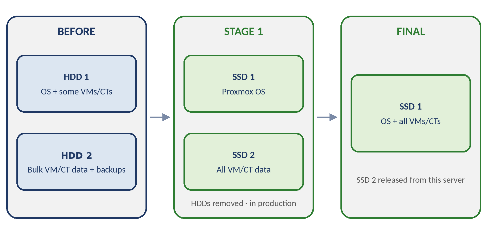
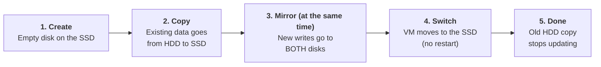
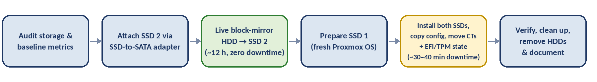
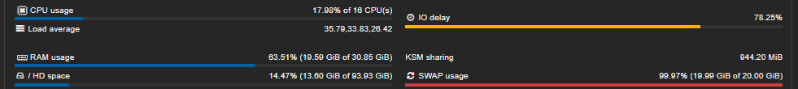
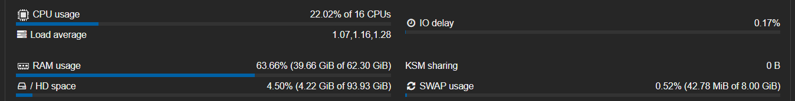

# Live HDD → SSD Migration on a Production Proxmox Server

**How I moved 9 live production workloads off failing hard drives onto SSDs, with zero data loss and only minutes of planned downtime.**

> **About this document:** This is a sanitized portfolio version of an internal runbook. Server names, VM/CT IDs, storage names, schedules, and company details are replaced with dummy values. The method, commands, and measured results reflect the real project.

---

## Contents

1. [Summary](#summary)
2. [The Problem](#the-problem)
3. [Constraints](#constraints)
4. [Solution Overview](#solution-overview)
5. [How Live Migration Works](#how-live-migration-works)
6. [Execution](#execution)
7. [Issues Encountered and Fixes](#issues-encountered-and-fixes)
8. [Results](#results)
9. [Lessons Learned](#lessons-learned)
10. [Skills Demonstrated](#skills-demonstrated)

---

## Summary

| | |
|---|---|
| **Situation** | A production server was badly slowed down by its hard drives. The OS disk was also showing signs of mechanical failure (abnormal platter noise). |
| **Risk** | 9 VMs and containers were serving live traffic, and the data changed constantly. |
| **Approach** | Live block-mirror migration in two stages: HDDs → two SSDs, then consolidated onto one SSD. |
| **Downtime** | Stage 1: about 30–40 min planned. Stage 2: about 5 min or less. Both outside working hours. |
| **Data loss** | None |
| **Outcome** | I/O delay dropped from **78.25% to 0.17%**. Load average dropped from **35.79 to 1.07**. |

> **Why "near-zero" downtime?** The bulk of the work, copying all VM disks, ran live with no interruption. Downtime was limited to the few components Proxmox cannot move while running (containers, EFI disks, TPM state).

---

## The Problem

The server ran **9 production workloads** on two large HDDs:

- **3 Windows Server VMs** hosting databases and business applications
- **6 Linux (LXC) containers**, including a CI/CD engine, reverse proxy, backup server, and DNS remap

| Disk | What it held |
|---|---|
| HDD 1 | Proxmox OS and some VMs/containers |
| HDD 2 | Most VM/container data and backups |

**Symptoms**

- Applications were slow and sometimes unresponsive, especially during backups and CI/CD builds.
- The dashboard showed **78.25% I/O delay** and a **load average of 35.79**, while CPU usage was only **17.98%**.
- **Swap was 99.97% full**, a sign of constant memory pressure.
- HDD 1 (the OS disk) was making abnormal noise, so a failure could happen at any time.

**Diagnosis:** The server was not short on processing power. It was *waiting on its disks*. Low RAM forced it to swap onto the same slow drives, which made the slowdown worse. This is a self-reinforcing loop.

---

## Constraints

| Constraint | Why it mattered |
|---|---|
| Little tolerated downtime | All workloads served production, including a scheduled backup system. |
| Data changing constantly | A simple backup-and-restore would lose every write made during the copy. |
| Slow source disks | The copy had to run on top of production traffic on the same drives causing the slowdown. |
| Failing OS disk | The data had to move before the disk died. |
| Temporary hardware link | The target SSD was connected through an SSD-to-SATA adapter that could not be touched for the full ~12-hour transfer. |

---

## Solution Overview

### Why live block-mirror

| Option | Downtime | Complexity | Verdict |
|---|---|---|---|
| Backup → reinstall → restore | Hours | Low | Too much downtime, and recent writes would be lost |
| **Live block-mirror** | **Near-zero** | High | **Chosen.** Needs careful handling of edge cases |
| Storage replication (DRBD / ZFS send) | Zero | Very high | Overkill for a one-time move |

### Two-stage plan

| Stage | Storage | Contents |
|---|---|---|
| Before | HDD 1 | Proxmox OS and some VMs/CTs |
| Before | HDD 2 | Most VM/CT data and backups |
| Stage 1 | SSD 1 | Proxmox OS |
| Stage 1 | SSD 2 | All VM/CT data. Both HDDs removed, server running in production |
| Final | SSD 1 | Proxmox OS, all VMs, all containers |
| Final | SSD 2 | Released from this server |

**Key idea:** The ~12-hour data copy onto SSD 2 ran *online* while the server kept working. SSD 1 was prepared separately with a fresh Proxmox install. Because the two tasks were independent, both SSDs went into the server together in one short step.

---

## How Live Migration Works

Think of it as **copying a book while someone is still writing in it**: you photocopy every page, and each time the writer adds a new line, it goes onto *both* the original and the copy. When the copy is complete, you simply hand the writer the copy.

Proxmox does this with `qm disk move` for VMs (and `pct move-volume` for containers). The VM keeps running the whole time.

| Step | What happens | Is the VM interrupted? |
|---|---|---|
| 1. Create | An empty disk is made on the SSD | No |
| 2. Copy | Existing data is copied over (this is the long part, ~12 h here) | No |
| 3. Mirror | **During the copy**, every new write is saved to both the HDD and the SSD, so nothing is lost | No |
| 4. Switch | Once both disks match, the VM switches to the SSD instantly | No |
| 5. Done | The old HDD copy is frozen and no longer updated | No |

**What cannot be moved live:** LXC containers, EFI disks, and TPM state (the virtual TPM used by Windows). These need a short stop, so I grouped them into planned maintenance windows.

---

## Execution

### Stage 1: HDDs → SSD 1 (OS) + SSD 2 (VMs/CTs)

1. **Audit:** Map every VM/CT, compare allocated vs. actual disk size, and confirm recent backups exist.
2. **Attach SSD 2:** Connect it through the SATA adapter and set it up as LVM-Thin storage.
3. **Live mirror:** Copy VM data (including three 100 GB Windows disks) to SSD 2 while in production. Total time about 12 hours, with zero downtime.
4. **Prepare SSD 1:** Install a fresh Proxmox OS on it separately.
5. **Hardware swap:** Install both SSDs (5 minutes at most), then copy the configuration from the old OS so the new one uses SSD 2 for VM/CT storage.
6. **Move remaining containers:** Stop, move, start.
7. **Move EFI disk and TPM state:** Brief VM stop for Secure Boot VMs.
8. **Verify:** Log into each VM/CT and check applications and data.
9. **Clean up:** Remove leftover disks from failed attempts, then remove both HDDs.

**Stage 1 downtime:** about 30–40 minutes in total, planned.

### Stage 2: Consolidation onto SSD 1

1. Live-mirror VM disks from SSD 2 to SSD 1 while production kept running (off-hours).
2. Move containers with stop → move → start, one after another to avoid saturating shared I/O.
3. Move EFI disk and TPM state with a brief VM stop, batched with the container moves.
4. Verify every VM/CT, then release SSD 2.

**Stage 2 downtime:** about 5 minutes or less. The whole stage took about 1 hour and had **no incidents**.

---

## Issues Encountered and Fixes

These all occurred in Stage 1.

### 1. Interrupted migration left an orphan disk
- **Symptom:** An SSH disconnect during a 100 GB disk move left a partial disk on the SSD.
- **Check:** `pvesm list <storage>` showed a duplicate disk, while `qm config <vmid>` still pointed to the old one (no cutover happened).
- **Fix:** Removed the partial disk with `pvesm free`, then re-ran the move inside **tmux** so it survives SSH drops.

### 2. "Logical volume in use" when deleting the orphan
- **Symptom:** `pvesm free` failed even though the VM config no longer used the disk.
- **Cause:** `fuser -v /dev/<vg>/<lv>` showed the VM's `kvm` process still holding the old disk open. QEMU does not always release it right after a cutover.
- **Fix:** Waited for the VM's normal restart during the maintenance window. The new process no longer held the disk.

### 3. Containers cannot be moved while running
- **Symptom:** `pct move-volume` returned *"cannot move volumes of a running container."*
- **Cause:** A container's filesystem is tied directly to the host kernel, unlike a VM disk, which QEMU abstracts.
- **Fix:** Short planned downtime per container (stop → move → start), staggered to protect I/O bandwidth.

### 4. TPM state cannot be moved while the VM runs
- **Symptom:** *"cannot move TPM state while VM is running."*
- **Cause:** The virtual TPM runs as a separate emulator process (`swtpm`), not as a regular disk.
- **Fix:** Moved during a brief VM stop, in the same window as other downtime-required work.

### 5. Broken VM config after repeated attempts
- **Symptom:** One VM had the same disk attached twice, plus a TPM entry in a path format that did not match its storage type.
- **Diagnosis:** Audited `qm config` for every VM and cross-checked against `pvesm list` to separate valid disks from broken references.
- **Fix:** Removed the duplicate with `qm set <vmid> --delete <slot>` and rewrote the TPM entry with `qm set <vmid> --tpmstate0 ...`. Inside Windows, the duplicate showed as **Offline** in Disk Management (matching disk signature), confirming it was safe to remove.

---

## Results

| Metric | Before | After | Change |
|---|---|---|---|
| I/O delay | **78.25%** | **0.17%** | −99.8% |
| Load average (1/5/15 min) | 35.79 / 33.83 / 26.42 | 1.07 / 1.16 / 1.28 | about −97% |
| Swap usage | **99.97%** (19.99 of 20 GiB) | **0.52%** (42.78 MiB of 8 GiB) | Nearly eliminated |
| Total RAM | 30.85 GiB | 62.30 GiB | 2× (upgraded during the project) |
| CPU usage | 17.98% | 22.02% | Small, healthy rise |
| Data loss | n/a | **0** | ✔ |
| Permanent VM/CT downtime | n/a | **0** | ✔ |
| Storage layout | 2× HDD (OS and data split) | **1× SSD (OS + VMs + CTs)** | Consolidated |
| Planned downtime | n/a | Stage 1: ~30–40 min · Stage 2: ≤ ~5 min | Off-hours |

### Proxmox dashboard: before and after

**Before:** 78.25% I/O delay, 35.79 load average, swap almost full

**After:** 0.17% I/O delay, 1.07 load average, swap nearly empty

**What the numbers mean:** A very high load average with low CPU usage is the classic sign of a server stalled on disk I/O. After the migration, processes stopped waiting on the disks, so load fell sharply and CPU usage rose slightly because the system was finally able to work.

*The "after" figures were essentially the same after Stage 1 and Stage 2, because the same SSDs were used in both.*

**Final state:** The OS, all VMs, and all containers run from SSD 1 with no issues. SSD 2 was detached and is being prepared for another use (load balancing).

---

## Lessons Learned

1. **Use `tmux` or `screen` for long disk operations.** An SSH drop mid-migration leaves a partial state that is painful to clean up.
2. **Restart, don't force-kill.** If QEMU keeps an old disk locked after cutover, a normal VM restart is the safest way to release it.
3. **A live migration is not a backup.** After cutover the old disk is frozen and no longer updated.
4. **Plan for non-live components early.** Separate what can move live from what cannot (containers, EFI, TPM) and batch the downtime into one window.
5. **Always audit afterward.** Compare every VM/CT config with what actually exists in storage to catch duplicate or broken references.
6. **Don't touch temporary hardware.** The SATA adapter stayed untouched for the entire 12-hour copy.
7. **Separate the slow copy from the hardware swap.** Doing the 12-hour copy online meant the physical swap took minutes.

---

## Skills Demonstrated

`Proxmox VE` · `QEMU/KVM` · `LXC` · `LVM / LVM-Thin` · `Live storage migration` · `Linux administration` · `Performance diagnosis (I/O wait, load, swap)` · `Downtime planning` · `Troubleshooting` · `Technical documentation`

---

## Author

**Hilmy Sonaji**, IT Infrastructure
[GitHub](https://github.com/your-username) · [LinkedIn](https://linkedin.com/in/your-profile)
